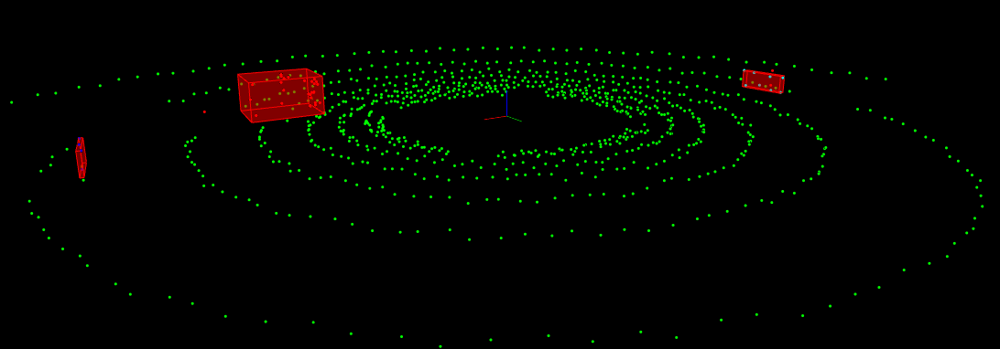
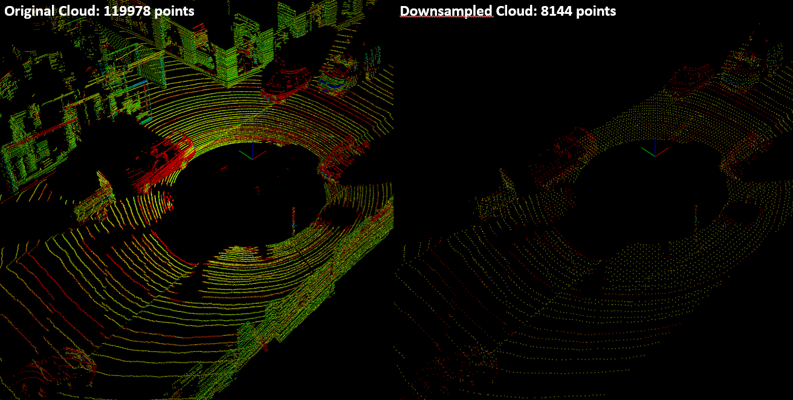

## Function List

- [ ] template <typename PointT>
typename pcl::PointCloud<PointT>::Ptr ProcessPointClouds<PointT>::FilterCloud

- [ ] template <typename PointT>
std::pair<typename pcl::PointCloud<PointT>::Ptr,
          typename pcl::PointCloud<PointT>::Ptr>
ProcessPointClouds<PointT>::SeparateClouds

- [ ] template <typename PointT>
std::pair<typename pcl::PointCloud<PointT>::Ptr,
          typename pcl::PointCloud<PointT>::Ptr>
ProcessPointClouds<PointT>::SegmentPlane

- [ ] template <typename PointT>
std::vector<typename pcl::PointCloud<PointT>::Ptr>
ProcessPointClouds<PointT>::Clustering
  - <https://pcl.readthedocs.io/projects/tutorials/en/latest/kdtree_search.html>

- [ ] template <typename PointT>
Box ProcessPointClouds<PointT>::BoundingBox

-----------------

## Project's Tasks

### Lidar and Point Clouds

 ✅ Dynamic Allocation of Lidar Object
  (environment.cpp)

- [x] Allocate a `Lidar` pointer object on the heap by invoking its constructor with two parameters: a std::vector<Car> and a setGroundSlope of 0.
- [x] Implement the `Lidar::scan()` method to perform ray casting, returning a `pcl::PointCloud<pcl::PointXYZ>::Ptr` as the result.
- [x] Utilize the `renderRays()` method to visually represent the cast rays on the viewer.

#### Wrap Up ✍️  

    - std::unique_ptr<Lidar> - std::make_unique : Use smart pointer
    - pcl::PointCloud<pcl::PointXYZ>::Ptr: to store pointcloud from scan()
  
  -----

✅ Enhanced Lidar Resolution
   (lidar.h)

- [x] Improve lidar resolution by adjusting the constructor parameters of the `Lidar` class, specifically `numLayers` and `horizontalAngleInc`.
- [x] Set `minDistance` to 5 meters to filter out points originating from the vehicle's rooftop.
- [x] Introduce a standard deviation `(sderr)` of 0.2 to incorporate a controlled amount of noise into the Point Cloud Data (PCD).
<br/><br/>

✅ Visualization Adjustments:
    (environment.cpp)

- [x] Exclude rendering for the highway scene and the representation of rays.
- [x] Enable rendering specifically for the point cloud through the `renderPointCloud()` method.

#### Wrap Up ✍️  

    - std::unique_ptr<Lidar> - std::make_unique : Use smart pointer
    - pcl::PointCloud<pcl::PointXYZ>::Ptr: to store pointcloud from scan()
  


-----

### Point Cloud Segmentation

✅ Segmentation Implementation in processPointCloud.cpp:

- [x] Implement the `ProcessPointClouds::SegmentPlane()` method in processPointCloud.cpp. Utilize a `pcl::SACSegmentation<PointT>` object to perform segmentation of the planar component from the provided input point cloud.

##### **`hello_world.cpp`**

```cpp
// Create the segmentation object
pcl::SACSegmentation<PointT> get_inliers;
// Define inliers var
pcl::PointIndices::Ptr inliers{new pcl::PointIndices()};
// Optional
get_inliers.setOptimizeCoefficients(true);
// Mandatory
get_inliers.setModelType(pcl::SACMODEL_PLANE);
get_inliers.setMethodType(pcl::SAC_RANSAC);
get_inliers.setDistanceThreshold(distanceThreshold);
// Create cofficients object
pcl::ModelCoefficients::Ptr coefficients(new pcl::ModelCoefficients);
// set input to model
get_inliers.setInputCloud(cloud);
// set where the output gonna be stored
get_inliers.segment(*inliers, *coefficients);
```

- [x] Implement the `SeparateClouds()` helper method, employing a `pcl::ExtractIndices<PointT>` object to extract points that do not belong to the segmented plane, representing the obstacle.

```cpp
pcl::ExtractIndices<PointT> extractMod;
extractMod.setInputCloud(cloud);
extractMod.setIndices(inliers);
extractMod.setNegative(true);
extractMod.filter(*cloud_outliers);
```

✅ Environment Point Cloud Processing in environment.cpp:

- [x] Create a `ProcessPointClouds<pcl::PointXYZ>` object in environment.cpp.
- [x] Invoke the `SegmentPlane()` method to perform segmentation and separate the plane and obstacle components within the point cloud.
- [x] Render the resulting plane and obstacle point clouds to visualize the segmented components.

#### Wrap Up ✍️  

    - std::unique_ptr<Lidar> - std::make_unique : Use smart pointer
    - pcl::PointCloud<pcl::PointXYZ>::Ptr: to store pointcloud from scan()


-----

### ⭐️ Identify Different Obstacles using Euclidean Clustering with PCL

#### Theory 📖  

    Cluster means:
    - Points within each cluster are similar to to each other
    - Points from different clusters are dissimilar
    - High-dimensional space, using distance measure: Euclidean, Cosine, Jaccard, KD-Tree
    (Clustering Algorithms by Standford CS345a)

✅ Cluster Extraction Implementation in processPointCloud.cpp:

- [x] Implement the `ProcessPointClouds::Clustering()` method in `processPointCloud.cpp`.
- [x] Create a Kd-tree-method object using `pcl::search::KdTree<PointT>::Ptr` for the input point cloud.

``` cpp
typename pcl::search::KdTree<PointT>::Ptr tree(new pcl::search::KdTree<PointT>);
tree->setInputCloud(cloud);
```

- [x] Configure parameters for the Euclidean clustering object by setting up an instance of `pcl::EuclideanClusterExtraction<PointT>`with Kd-tree object as method.

``` cpp
typename pcl::EuclideanClusterExtraction<PointT> ec;
ec.setClusterTolerance(clusterTolerance);
ec.setMinClusterSize(minSize);
ec.setMaxClusterSize(maxSize);
ec.setSearchMethod(tree);
ec.setInputCloud(cloud); //typename pcl::PointCloud<PointT>::Ptr cloud
ec.extract(clusterIndices); //std::vector<pcl::PointIndices> clusterIndices;
```

- [x] Use the clustering object to extract clusters from the input pointcloud.

```cpp title="cpp"
std::vector<typename pcl::PointCloud<PointT>::Ptr> clusters;
std::vector<pcl::PointIndices> clusterIndices;

for (const auto &it : clusterIndices) {
    typename pcl::PointCloud<PointT>::Ptr cluster(new
        pcl::PointCloud<PointT>);
    // Iterate through the indices of a cluster([pointIt : it.indices]) in the
    // pointcloud(cloud), extract corresponding points (cloud->points), and add
    // them to the newly created cluster.
    for (const auto &pointIt : it.indices) {
      cluster->push_back(cloud->points[pointIt]);
    }
    cluster->width = cluster->size();
    cluster->height = 1;
    cluster->is_dense = true;
    // Add the cluster to the return cluster vector
    clusters.push_back(cluster);
}

```

,alternative for shorter form:

```cpp
std::transform(
    clusterIndices.begin(), 
    clusterIndices.end(),
    std::back_inserter(clusters),
    [&cloud](const pcl::PointIndices &indices) { // lambda func
        typename pcl::PointCloud<PointT>::Ptr cluster(new pcl::PointCloud<PointT>);
        pcl::copyPointCloud(*cloud, indices.indices, *cluster);
        return cluster;
    }
 );
```

✅ Integration in environment.cpp:

- [x] In environment.cpp, invoke the clustering method on the segmented obstacle point cloud obtained from the `SegmentPlane()` operation.
- [x] Render the clustered obstacle points using distinct colors for each cluster to enhance visual representation.

```cpp
std::vector<pcl::PointCloud<pcl::PointXYZ>::Ptr> cloudClusters =
  pointProcessor->Clustering(segmentCloud.first, 1.0, 3, 30);

std::vector<Color> colors = {Color(1, 1, 0), Color(1, 0, 0.5),
                       Color(1, 0.5, 0), Color(0.7, 0.4, 1)};

for(const auto &cluster : cloudClusters) {
    int cluster_ID = 0
    renderPointCloud(viewer, cluster, "obstacle cloud" + std::to_string(cluster_ID), color[cluster_ID]);
}
```


### Bounding Boxes

✅ Once point cloud clusters are found, we can add bounding boxes around the clusters.
The boxed spaces should be considered as an area/object that our car is not allowed to enter, otherwise it would result a collision.

- [x] Call `ProcessPointClouds::BoundingBox()` method, which finds the max and min point values as the boundary values for the `Box` data structure. Then render the `Box` structure for each cluster.

```cpp
renderBox(viewer, pointProcessor->BoundingBox(cluster), clusterId);
```



### Load Real PCD

- [x] Create a new point processor for the real PCD from a `cityBlock`that is similar to the `simpleHighway` function.
- [x] The point type is `pcl::PointXYZI` where the `I` indicates the intensity. The real PCD files are located at `src/sensors/data/pcd/data_1/` directory.

```cpp
std::unique_ptr<ProcessPointClouds<pcl::PointXYZI>> pointProcessor = std::make_unique<ProcessPointClouds<pcl::PointXYZI>>();
typename pcl::PointCloud<pcl::PointXYZI>::Ptr inputCloud = pointProcessor->loadPcd("path_to_file");
// render point cloud 
renderPointCloud(viewer, inputPoint, "name_pointCloud"); //pcl::visualization::PCLVisualizer::Ptr &viewer
```


### Filter with PCL

To implement the `ProcessPointClouds::FilterCloud()` in the `processPointClouds.cpp`:

- [ ] `pcl::VoxelGrid<PointT>` class is applied for **Voxel Grid** filtering.

```cpp
  typename pcl::PointCloud<PointT>::Ptr reduced_cloud{
      new pcl::PointCloud<PointT>()};
  // create voxelgrid object to downsampling pointcloud
  typename pcl::VoxelGrid<PointT>::Ptr voxelGrid_handler =
      std::make_shared<pcl::VoxelGrid<PointT>>();
  voxelGrid_handler->setInputCloud(cloud);
  voxelGrid_handler->setLeafSize(0.1, 0.1, 0.1); // sample
  voxelGrid_handler->filter(*reduced_cloud);
```

- [ ] `pcl::CropBox<PointT>` class is applied for **ROI-based** filtering.

```cpp
  typename pcl::PointCloud<PointT>::Ptr cropbox_cloud{
      new pcl::PointCloud<PointT>()};
  // create Cropbox object to region based filtering
  pcl::CropBox<PointT> box_filter;
  // setting pcl::CropBox filter
  box_filter.setMin(minPoint);
  box_filter.setMin(maxPoint);
  box_filter.setInputCloud(reduced_cloud);
  box_filter.filter(*cropbox_cloud);
```

**NOTE:** The `Eigen::Vector4f` class has four parameters representing `x`, `y`, `z` coordinates and the last one should be 1.0.
We are interested in a good amount of distance in front or at back of the car and surroundings of the car. Point cloud data outside of the ROI should be removed, including the rooftop points.

2. [ ] In the `environment.cpp`, call `ProcessPointClouds::FilterCloud()` function in the `cityBlock()`. Input a leaf size of 0.2m, so that the voxel size is large enough to help speed up the processing but not so large that object definition is preserved.



### Obstacle Detection with Real PCD

1. [ ] Once having a filtered PCD, we can deploy the same segmentation and clustering techniques implemented previously in the `cityBlock()`. ([85cc8c6](https://github.com/fanweng/Udacity-Sensor-Fusion-Nanodegree/commit/85cc8c67cd2f583271c9ee34505688f0ca5cb1ac))
2. [ ] Tweak the `Eigen::Vector4f minPoint/maxPoint` for `ProcessPointClouds::FilterCloud()` and `int minSize/maxSize` for `ProcessPointClouds::Clustering()`. ([85c7c1a](https://github.com/fanweng/Udacity-Sensor-Fusion-Nanodegree/commit/85c7c1adbbf2f8384f71459dedb09f24b828bac1))


### Stream PCD

1. [ ] Create a vector `stream` to store paths to the PCD files chronologically. Create a new `cityBlock()` function, which processes the input point cloud from the external. In the `main()` function of `environment.cpp`, inside the viewer update loop, read PCD file, process it and update the viewer. ([221ce08](https://github.com/fanweng/Udacity-Sensor-Fusion-Nanodegree/commit/221ce08a98a9bc8baafab0f302819afac91ac2bf))


